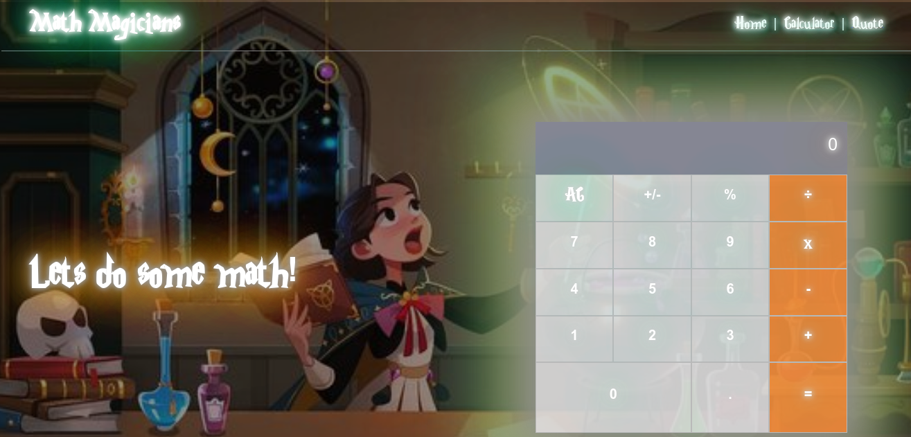

# Math Magician



> A single page app build using react


Additional description about the project and its features.

## Tech used

- React
- Git
- npm
- webpack

# Setup WebApp

#### Cloning the project

```
git clone git@github.com:vikipretium/Math_Magicians.git
```

## Usage

To build the project and run:

```
npm install
npm start
```

## Author

👤 **Vignesh**

- GitHub: [@vikipretium](https://github.com/vikipretium)
- Twitter: [@vikipretium](https://twitter.com/vikipretium)
- LinkedIn: [vikipretium](https://linkedin.com/in/vikipretium)

👤 **PASCAL KABIKA MP.**

- GitHub: [KABIKA681](https://github.com/KABIKA681?tab=overview&from=2021-12-01&to=2021-12-31)
- [LinkedIn](https://www.linkedin.com/in/pascal-kabika-443061220/)

Contributions, issues, and feature requests are welcome!

Feel free to check the [issues page](../../issues/).

## Show your support

Give a ⭐️ if you like this project!

## Acknowledgments

- Hat tip to anyone whose code was used
- Inspiration
- etc

## 📝 License

This project is [MIT](./MIT.md) licensed.
